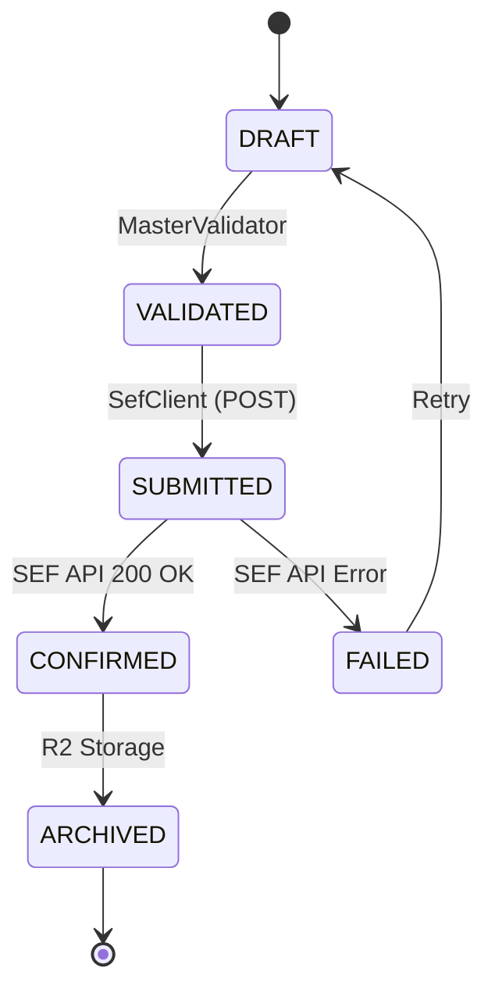

# SEF Bridge - Tehnička dokumentacija (v4.20.0)

## 1. Arhitektura (ADR)
### ADR 001: Read-Model (Local-First) Storage
- **Odluka**: Korišćenje D1 baze (SQLite unutar DO) i R2 bucketa kao primarnog izvora istine.
- **Kontekst**: Eksterni SEF API ima visoku latenciju i ograničenu istoriju.
- **Posledica**: Dashboard učitava podatke iz lokalne D1 baze (<50ms), nezavisno od dostupnosti MFIN servera.

## 2. Finite State Machine (FSM)
Sistem koristi determinističke tranzicije za upravljanje životnim ciklusom fakture, čime se osigurava idempotencija.

## 3. Compliance Matrix
| Funkcionalnost | Status | Implementacija |
| :--- | :--- | :--- |
| UBL 2.1 SrbDtExt | Stable | `SefUblBuilder` |
| Automatska arhivacija | Active | `R2` / `Worker Lifecycle` |
| Circuit Breaker | Active | `EdgeGuard.ts` |
| Normalizacija podataka | Active | `Normalizer.ts` |

## 4. Troubleshooting
| Kod Greške | Opis | Akcija |
| :--- | :--- | :--- |
| `[Shield-386]` | Neispravan avans (fali datum/PIB) | Proverite `datumUplate` i `ublExtensions`. |
| `[Shield-381]` | Neispravno odobrenje | Proverite `billingReference`. |
| `[MasterValidator]` | FATAL | Faktura ne sme napustiti server (XML neispravan). |

## 5. Changelog
- **v4.20.0**: Implementacija FSM modela i MasterValidator-a.
- **v4.19.0**: Implementacija Normalizer pattern-a.
- **v4.16.0**: Agresivno v1/v3 otkrivanje faktura i XML forenzika.
- **v4.15.0**: Migracija na Read-Model arhitekturu (D1/R2).
